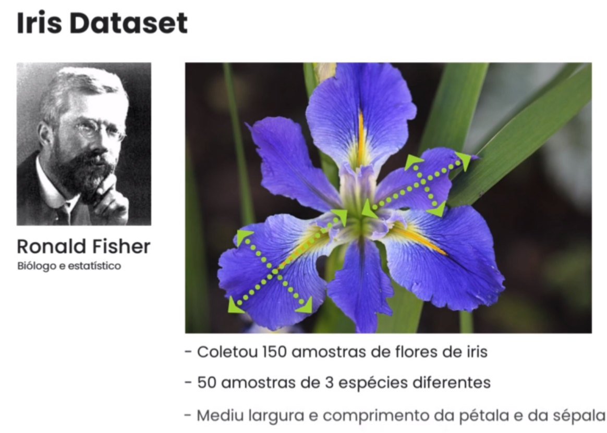

# Python Machine Learning

[**glossary**](doc/glossary/glossary.md)

### Dependencies

```bash
python3 -m venv venv
source venv/bin/activate

pip install scipy
pip install scikit-learn
pip install ipython
pip install ipython\[notebook\]
```

- **scipy** -  an Open Source library in Python language that was made for mathematicians, scientists and engineers
- **scikit-learn** -  an open source machine learning library
- **ipython** e **ipython[notebook]** - **jupyter notebook** dependency lib

### Run the notebook

```bash
cd project_dir
jupyter notebook
```

### Iris Dataset

A dataset we will gonna use




- Train the computer to recognize the species of an Iris flower based on measurements
- Apply statistical models
- Create an app in which we will provide the measurements and it will return the species of the plant


