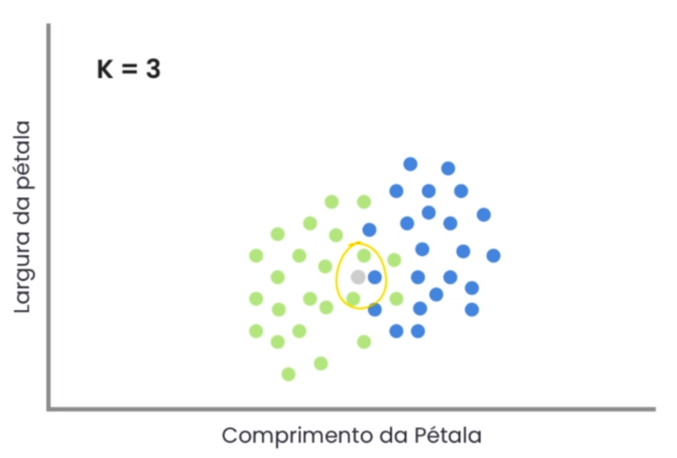

# glossary

### numpy.ndarray

It's like a list, but much more efficient and with additional methods

widely used in machine learning due to its efficiency in working with giant data

### ndarray.shape

to get the size of the numpy list

# Statistical models

## KNN (K Nearest neighbors)
- K neighbors nearest

- if K = 1 then the nearest is blue, so K is blue
- if K = 3 then we have 3 nearest 2 green and 1 blue, so K is green

